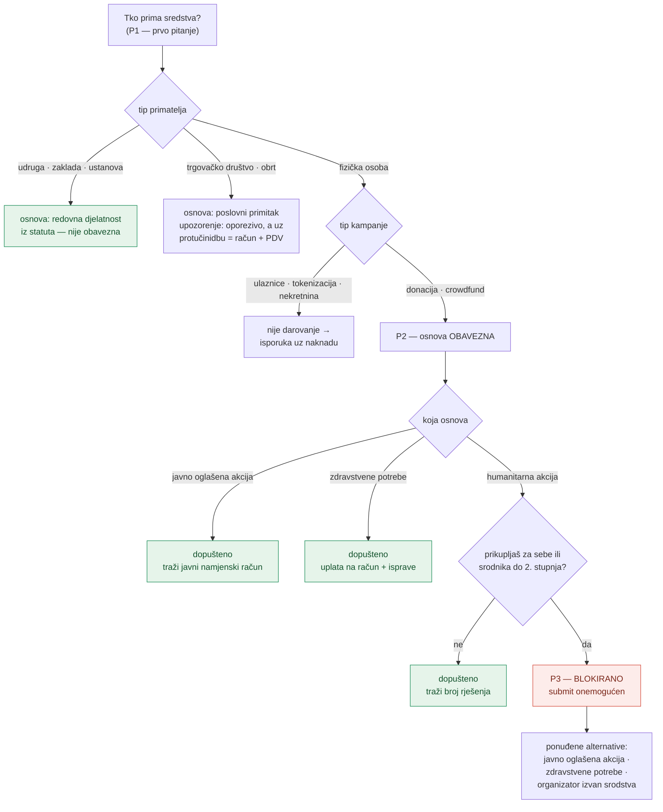

# Pravni gate pri kreiranju kampanje — arhitektura i odluke

Zapisano 8. kolovoza 2026. Objašnjava **zašto** je gate ovako oblikovan, jer se
iz koda vidi samo *što* radi. Pravna podloga s NN brojevima i citatima je u
`pinka-finance/landing/docs/pravni-okvir-primanja-sredstava.md` — ovaj dokument je
ne ponavlja.

---

## Zašto uopće

Forma je do ovog commita dopuštala bilo kome da otvori kampanju tipa „donacija",
bez ijedne provjere tko prima i po kojoj osnovi. U Hrvatskoj to znači dvije
konkretne posljedice:

1. **Zakon o humanitarnoj pomoći (NN 156/23, čl. 23)** zabranjuje fizičkoj osobi
   da organizira humanitarnu akciju za sebe, partnera ili srodnika do 2. stupnja.
   Prikupljanje bez rješenja je prekršaj (2.650–6.630 €).
2. **Zakon o porezu na dohodak (čl. 8. st. 1. t. 5.)** izuzima darovanja od poreza
   samo ako su prikupljena u humanitarnoj ili javno oglašenoj akciji. Izvan tih
   osnova primatelju nastaje **oporeziv dohodak** — o čemu nije ni znao.

Pinka ne drži sredstva, ali to ovdje ne pomaže: zakon regulira **prikupljanje**,
ne platni kanal.

---

## Tijek odluke



---

## Odluke koje nisu očite iz koda

### Blokada je namjerno uska

Blokira se **samo** kombinacija *fizička osoba + humanitarna akcija + srodstvo*.
„Javno oglašena akcija" se **ne** blokira iako je riječ o istoj osobi koja
prikuplja za sebe — jer ta porezna kategorija upravo pretpostavlja *„javno objavljen
račun fizičke osobe u potrebi"*.

Široka blokada („fizička osoba ne smije prikupljati za sebe") bila bi jednostavnija
za implementaciju i **pogrešna** — zatvorila bi jedini legalni put za taj slučaj.

### Bez DB migracije

Deklaracija ide u `metadata` JSONB koji `create_campaign` RPC već prima
(`p_metadata`). Nije trebalo dirati `domovina-api`, što je bitno jer taj repo nije
vidljiv odavde i migracija bi blokirala isporuku.

Cijena: nema server-side validacije. Gate je **klijentski** — tehnički potkovan
korisnik ga može zaobići pozivom RPC-a izravno. To je prihvaćeno jer je svrha
gatea informirati organizatora i dokumentirati njegovu izjavu, a ne spriječiti
zlonamjernog aktera. **Ako se ikad traži prava brana, mora ići u RPC/RLS u
domovina-api.**

### `setCampaignLegal` postoji zbog jedne zamke

`updateCampaign` radi običan `.update(patch)`. Da sam kroz njega proslijedio
`metadata`, **pregazio bi cijeli objekt** i obrisao `metadata.safe` — adresu
Safe novčanika kampanje. Zato zaseban writer koji čita postojeći `metadata` pa
spaja, isti obrazac kao `setCampaignSafe`.

Isto vrijedi za svaki budući ključ u `metadata`.

### AI import ne može podmetnuti pravna polja

`pinka.campaign.v1` parser (`lib/campaign-config.ts`) je whitelist — ne poznaje
`recipientType`, `legalBasis` ni ostalo, pa zalijepljeni JSON iz ChatGPT-a ne može
postaviti pravnu osnovu. To je bilo besplatno (whitelist je već postojao radi
`destinationAddress`), ali provjeri da ostane tako ako se parser ikad proširi.

---

## Testiranje

`npm run test:legal` — 33 assertiona nad stvarnim modulom (esbuild bundla
`lib/legal.ts`, isti obrazac kao `test-campaign-config.mjs`). Pokriva P1/P2/P3,
nevaljane kombinacije osnove i primatelja, round-trip serijalizacije i odbacivanje
nepoznatog `recipient_type`.

**Što testovi ne pokrivaju:** ništa vizualno. `/dashboard/new` je iza eOsobne
prijave pa se forma renderira tek nakon logina — statički `out/dashboard/new.html`
sadrži samo auth gate. Provjera da je copy uopće isporučen radi se nad **client
bundleom**:

```bash
npm run build
grep -rl "Tko prima sredstva" out/_next/static/chunks/   # mora naći 1 chunk
```

---

## Otvoreno

- **Raspored i izgled nitko nije vidio.** Nova sekcija je prva u formi, crveni
  panel blokade i checkbox izjave nisu pregledani u pregledniku.
- **Server-side validacija ne postoji** (vidi gore) — ako se odluči da treba,
  ide u `create_campaign` RPC.
- **Otvorena pravna pitanja** koja mijenjaju dizajn gatea ako odgovor bude „ne":
  je li Pinka „organizator" po ZHP-u, i vrijedi li „javno objavljen račun" kad je
  to on-chain Safe adresa a ne IBAN. Puni popis u `landing/docs/pravni-okvir-primanja-sredstava.md` §9.
- **P4–P7** iz istog dokumenta nisu implementirani: pitanje o protučinidbi
  (sponzorstvo → račun), upozorenje kod ulaznica na razini tipa kampanje, izjava o
  namjeni viška, i uvjeti korištenja koji fiksiraju da je organizator odgovoran.
